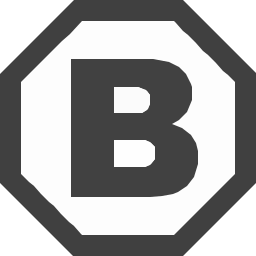

  <!-- Typing SVG by DenverCoder1 - https://github.com/DenverCoder1/readme-typing-svg -->

---
<!-- Quote -->

## 💭 Quote

### ✨ ***"To create something extraordinary, all it takes is the belief that it is!"***

<!-- Bio section -->

## About Me

- 💡 Hobby: I am passionate about developing innovative apps that significantly improve my daily life, especially when existing solutions are lacking or I simply prefer not to invest in an app that doesn't fully align with my requirements.
- 🎯 Goal: I am determined to become a full-stack developer so I can take charge of creating innovative applications and make significant contributions to impactful projects.
- ⚡ Fun fact: When I encounter a problem, I actively seek out new solutions until I find a resolution!

<!-- Techs section -->

 

<h2>🛠️ My Tech Stack</h2>

<!-- https://github.com/Ileriayo/markdown-badges -->
<!-- https://github.com/alexandresanlim/Badges4-README.md-Profile -->
<!-- http://github.com/badges/shields --><!-- https://shields.io/docs/logos --><!-- https://simpleicons.org/?q=row -->
<!-- https://skillicons.dev -->
<h3>👨‍💻 Programming and Markup Languages</h3>

&nbsp;
&nbsp;
&nbsp;
&nbsp;
&nbsp;
&nbsp;
&nbsp;
&nbsp;

<h3>🧰 Frameworks and Libraries</h3>

&nbsp;
&nbsp;
&nbsp;
&nbsp;
&nbsp;
&nbsp;
&nbsp;
&nbsp;
&nbsp;

<h3>🗄️ Databases and Cloud Hosting</h3>

&nbsp;
&nbsp;
&nbsp;
&nbsp;
&nbsp;

<h3>💻 Software and Tools</h3>

&nbsp;
&nbsp;
&nbsp;
&nbsp;
&nbsp;
&nbsp;
&nbsp;
&nbsp;
&nbsp;
&nbsp;
 &nbsp;
 &nbsp;
 &nbsp;
&nbsp;
&nbsp;
&nbsp;
 &nbsp;
 &nbsp;
 &nbsp;
 &nbsp;
 &nbsp;

<h3>📝 Learning</h3>

<!-- language -->
&nbsp;
&nbsp;
&nbsp;
&nbsp;
  
<!-- framework -->
&nbsp;
&nbsp;
&nbsp;

&nbsp;
&nbsp;

<!-- &nbsp; -->
&nbsp;
&nbsp;
&nbsp;
&nbsp;
&nbsp;

<!-- Stats section -->

## 💻 GitHub Profile Stats

<blockquote>

 
<b>Note:</b> Top languages is only a metric of the languages my public code consists of and doesn't reflect experience or skill level.
</blockquote>

<!-- Social icons section -->

## 📫Contact Me

> &nbsp;
&nbsp;
&nbsp;

<!-- Donate section -->

## 💖 Support Me

If you find value in what I create, your support would mean the world to me.

